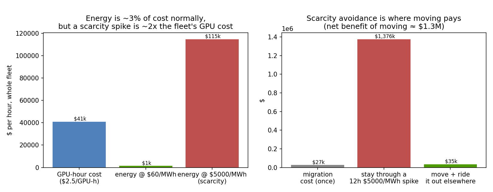
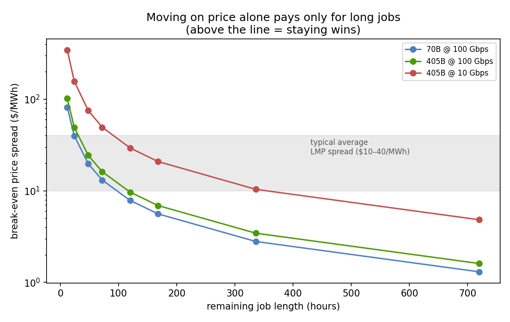

# Compute↔Power Placement: schedule against scarcity, don't arbitrage the spread

**Idle GPUs sit in one place; cheap or curtailed power sits in another — so should you move the job to the power?** The grid heat map makes it tempting: US ISOs publish 5-minute nodal price maps that span from *negative* prices to $28,000/MWh within months [1], while ~20 TWh of renewables were curtailed in 2024 and 226 GW of data-center load waits years in the interconnection queue [2, 3]. This repository answers the move-vs-stay question in the operator's units — and the answer reframes the problem.

**TL;DR:** on a *running* fleet, electricity is only **~3–4% of the GPU-hour cost** [4], so chasing the $/MWh spread barely moves the total — and a migration idles the whole fleet and needs an idle fleet already waiting at the destination. Moving on price alone pays only for **long jobs against a sustained spread**. But relocation pays **decisively at the scarcity boundary**: dodging one 12-hour $5,000/MWh spike is worth **~$1.3M** against a ~$27k migration. The lever is **"schedule against scarcity," not "arbitrage the spread"** — the continuation of the [scheduling repo's](https://github.com/dimaggi-ai/scheduler-vs-more-gpus) power-as-a-schedulable-resource pattern, from modulating draw in place to moving work across the map.

*Fourth quantitative pillar of the DIMAGGI series on turning GPU capital into usable compute. Full analysis in [docs/study.md](docs/study.md); all claims trace to [REFERENCES.md](REFERENCES.md).*

---

## The reframe, in one figure



Energy is a minority of the GPU-hour cost (~3.4% at $60/MWh and 1.4 kW; 7–11% in published TCO analyses that assume $83–120/MWh [4]), so the average price spread cannot move the decision — but a scarcity spike is ~2× the fleet's entire GPU cost, and *that* is what moving should avoid.

## The break-even frontier



For a 405B job (~6.5 TB state) on 16,384 GPUs, one migration costs ~$27k (mostly ~0.6 h of fleet idle). Earning that back on a $30/MWh spread needs the job to keep running for days; typical *average* spreads ($10–40/MWh) sit right in the marginal band, so most jobs should stay. The [`move-vs-stay` model](calc/move_vs_stay.py) computes the decision, the break-even spread, and the scarcity-avoidance benefit for any job.

A companion [`fleet`](fleet/) model extends this from one decision to a fleet policy. Under the model's $5,000/MWh spike ceiling, a scarcity-aware scheduler that curtails the flexible load in only the ~0.4% worst hours saves **4.8%** of the fleet's energy bill (a 24-seed mean; **3.4% in the pictured month**). That percentage is bound by the ceiling: at **$2,000/MWh — ERCOT's real-time system-wide offer cap since the RTC+B go-live on 2025-12-05 — it is 2.7%**, and both figures are pinned in CI so neither can be quoted alone.

What is portable is not the percentage but the **ranking**: spending the same curtailment budget on the highest-priced eligible hours beats spending it on a *random* selection of the same hours in **every one of 24 simulated price years** (1.4–2.0×), and beats the reversed policy by 2.6–8×. That is the claim that can fail, so it is the one the validation registry asserts. The avoided cost is also concentrated — ~80% of it falls in the top 1% of hours — but that number is identical however the scheduler spends its budget, so it describes the *price process*, not the policy, and this repo no longer presents it as the finding.

## The hard boundary: what can actually move

Inference geo-routes freely (890+ GW of wind within 50 ms RTT of Azure [7]); **synchronous frontier training does not** (43 ms coast-to-coast RTT kills it [8]) — the escape route is async low-communication training (DiLoCo-class), proven at 10B but not frontier scale [9]. So the highest-value workload is the least movable, which is exactly why the honest lever is scarcity-aware scheduling and siting — the production instances are power-seeking operators (Crusoe, Lancium, Soluna) and grid-interactive designs (Emerald AI, the 96 MW Aurora facility) [12, 13].

## The validation project

A sixteen-point registry ([validation.py](validation.py)) runs in CI,
split into three kinds, with a column recording which model each point
actually exercises — a check that touches no model is not evidence about
a model, and the summary counts them separately.

**Calibrated** (4) — compared against a figure a cited source publishes:
the 6,480 GB (16 bytes/param) 405B state [5], the 3.4% energy share of a
GPU-hour [4], and two pure source-arithmetic checks (20 TWh curtailed /
176 TWh DC load = 11% [2]; 400 TB at 5 Pbit/s = 0.64 s [8]).

**Emergent** (4) — behaviours nothing was tuned to produce, asserted over
24 **8,760-hour synthetic price years**. The two central ones measure the
scheduler's price ranking against *the same scheduler with its ranking
removed and reversed*, so they fail if ranking by price buys nothing —
and at month scale they **do** fail, in 5 of 23 seeds, which is why the
year runs exist and why that result is stated here rather than dropped.
The other two pin the headline saving at both spike ceilings (4.8% at
$5,000/MWh, 2.7% at $2,000). All four carry ref `-`: they run on
synthetic prices, and no source publishes them.

**Sanity** (8) — deterministic properties, claiming no evidence: that the
$5,000 ceiling is a model *input* rather than a quoted cap, that the
top-1% concentration is blind to the policy, that curtailment is 0.12% of
fleet energy against Duke's 0.25% [6], that the saving is *exactly* zero
with the scarcity process off, the $1.34M-vs-$26.5k spike-dodge pair, the
39.17-hour break-even, and that every ref printed resolves to a
REFERENCES.md entry.

Four anchors the registry deliberately does **not** check are named in
its `DECLINED` list and printed with the table. Note the limit of the ref
check: it proves each ref *number* resolves, not that REFERENCES.md
paraphrases its sources faithfully — no numeric check can, and this repo
does not claim otherwise.

```
make validation    # the registry, models vs public record
```

## Reproduce

```
pip install -r calc/requirements.txt
make test        # the registry + move-vs-stay and fleet invariants
make figures     # break-even, energy-share/scarcity, and the fleet figure
```

Python 3.11+, `numpy`, `matplotlib`. Every calibration value is an input; see [docs/study.md](docs/study.md#what-a-skeptic-should-attack) for what to push on (the destination-fleet precondition, data gravity, the $/GPU-hour assumption).

## Series — turning GPU capital into usable compute

- **GPU Cluster Networking** ([network-vs-more-gpus](https://github.com/dimaggi-ai/network-vs-more-gpus))
- **GPU Cluster Scheduling** ([scheduler-vs-more-gpus](https://github.com/dimaggi-ai/scheduler-vs-more-gpus)) — power as a schedulable resource
- **Compute↔Power Placement** (this work) — move work across the grid map, priced
- **Chaos Fidelity Standard** ([ai-cluster-chaos-fidelity](https://github.com/dimaggi-ai/ai-cluster-chaos-fidelity)) · **Reliability Economics** ([reliability-economics](https://github.com/dimaggi-ai/reliability-economics))

---

*Margaret (Maggie) Nanyonga — Founder & Principal Architect, [DIMAGGI AI](https://dimaggi.ai). Governed AI infrastructure: the control, reliability, and audit layer for autonomous systems operating production networks and compute.*
