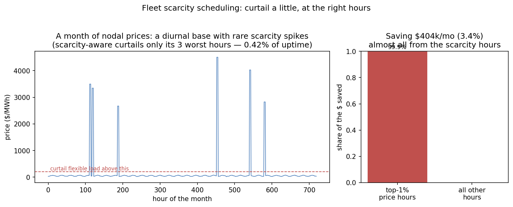

# Compute↔power placement: schedule against scarcity, don't arbitrage the spread

Reference numbers point to [REFERENCES.md](../REFERENCES.md). Numbers reproduce with `python3 calc/run.py`.

## The heat map is real

Overlay the compute fleet on a grid heat map and the mismatch is literal: US ISOs publish 5-minute nodal price maps (ERCOT's live LMP contour; every ISO via the EIA portal) [1], and the dispersion is extreme — CAISO spent ~13% of 2024 hours at *negative* prices while one ERCOT node averaged **$28,187/MWh** for an hour in Feb 2025 [1]. Both sides are stranded: ~**20 TWh** of US wind and solar were curtailed in 2024 (≈11% of all US data-center electricity) [2], while **226 GW** of mostly-data-center load waits ~5 years in ERCOT's interconnection queue [3]. So the founder's picture — idle GPUs here, cheap or curtailed power there — is a measured, daily reality, not a metaphor.

The tempting conclusion is "move the compute to the power." This study asks, in the operator's units, when that actually pays — and the answer reframes the whole problem.

## The reframe: energy is a rounding error on a running fleet

At $2–3/GPU-hour, electricity is only **~3–4% of the GPU-hour cost** (a burdened H100 draws ~1.4 kW; at $60/MWh that is ~$0.08/h against a ~$2.5/h GPU-hour) [4]. So chasing the $/MWh *spread* on a *running* fleet moves total cost by low single digits — and moving is not free: a migration idles the **whole** fleet during drain + WAN transfer + reload, and it requires an **equal idle fleet to already exist at the destination** (a capacity cost that dwarfs any energy saving). The [`move-vs-stay` model](../calc/move_vs_stay.py) makes this precise.

## When does moving on price alone pay?

For a 405B-parameter job (≈6.5 TB of training state [5]) at $2.5/GPU-hour on 16,384 GPUs, one migration costs ~$27,000 (mostly the ~0.6 h of fleet idle; WAN egress is ~$130). Earning that back on a $30/MWh spread requires the job to *keep running* long enough:

| Remaining job length | Break-even spread needed | Decision at a $30/MWh spread |
|---|---|---|
| 24 h | ~$49/MWh | **stay** |
| 72 h | ~$16/MWh | move |
| 168 h (1 week) | ~$7/MWh | move |
| 720 h (1 month) | ~$2/MWh | move |

So pure spread-arbitrage pays only for **long-running** jobs against a **sustained** advantage — and typical *average* nodal spreads are $10–40/MWh, right in the marginal band. For any short or medium job, staying wins. Relocating a job to chase the mean price is, for most jobs, a loss.

## Where relocation decisively pays: scarcity

The picture flips at the **scarcity boundary**. Staying through a single 12-hour, $5,000/MWh price spike costs the fleet **~$1.38M** in electricity; moving off it (migration + running elsewhere) costs ~$35k — a **~$1.3M net benefit from one avoided spike**, versus the ~$27k it costs to move. One avoided scarcity-day is worth more than a year of average-price optimization. The same logic covers the larger prizes the model does not price directly: **queue access** (226 GW stuck; a Duke study finds 76 GW of new load fits the existing grid if loads curtail just 0.25% of annual *energy* [6]) and PJM capacity at a record $329/MW-day [3].

**The thesis, therefore:** the lever is not "arbitrage the $/MWh spread" — energy is too small a share for that to matter on a running fleet. It is **"schedule against scarcity"**: modulate and, where the workload and fabric allow, relocate to *avoid the spikes and reach the stranded power/queue capacity*. The geographical-load-balancing literature established both the price-routing idea and its limit — that naive price-chasing can *raise* total energy use — a generation ago [14]; the AI-era contribution is pricing it in GPU-hours against real nodal dispersion. This is the direct continuation of the [scheduling repo's](https://github.com/dimaggi-ai/scheduler-vs-more-gpus) Pattern 6 (power as a schedulable resource) [15] — from modulating draw in place to moving work across the map.

## From one decision to a fleet policy

The move-vs-stay model prices a single relocation. The [`fleet`](../fleet/) model extends it to a policy that is still *under-built as a priced, general control*: a data-center fleet with a flexible (deferrable/curtailable) load fraction against a real-shaped price process — a diurnal base with rare multi-hour scarcity spikes — under a *scarcity-aware* scheduler that curtails the flexible load in the worst hours (within a small budget) and defers it to the cheapest.

The result confirms the single-decision thesis at fleet scale — and it is a *concentration* result, not a spread result:

- **Small in size, and bound by the spike ceiling.** Under the synthetic $5,000/MWh spike ceiling, a scarcity-aware scheduler saves **4.8%** of the fleet's monthly electricity bill (a 24-seed mean; **3.4% in the pictured month**, and *nothing* in the ~6% of months with no qualifying spike). The percentage tracks the ceiling almost proportionally: $2,500 → 3.2%, **$2,000 → 2.7%**, $1,000 → 1.6%. So halving the ceiling costs about a third of the saving, and it takes a *fifth* of the ceiling to third it — an earlier version of this study said "halving the cap roughly thirds the saving," which is wrong. The $2,000 figure matters most: since ERCOT's RTC+B go-live (2025-12-05) the real-time system-wide offer cap **is** $2,000/MWh, so 2.7% is the number to quote for a real-time-exposed fleet.
- **The value is in the spikes, and in ranking them.** Turn the scarcity process off and no hour reaches the $200 threshold at all, so the policy is inert and the saving is **exactly zero** — not "<1% of diurnal deferral," which described a mechanism this model does not have. What the scheduler contributes is the *ranking*: spending the same budget on the highest-priced eligible hours beats spending it on a random selection of them in **every one of 24 simulated price years** (1.4–2.0×, and 64/64 over a wider seed set), and beats the reversed policy by 2.6–8×. That is the claim that can fail, and the one worth carrying.
- **The concentration is real but it is not about the policy.** A scheduler *free to curtail every hour above the threshold* draws **80% of its avoided cost from the most-expensive 1% of hours** (dollar-weighted over 24 price years). This is a property of the *price process* — reversing the scheduler's ranking changes it by less than 1e-6 — set by the spike rate and spike length. Earlier drafts called it "what survives every calibration"; it survives because it was built in.
- **A tiny budget does not capture most of the value.** Curtailing only the ~3 worst hours a month (≤0.4% of uptime) captures a **mean of 43%** of what an unconstrained policy achieves, ranging 16–75% across seeds. The small budget is cheap and worthwhile, not sufficient.

This *rhymes with* the operator reality the grid-flexibility work reports — Duke finds ~76 GW of new load fits the existing grid if new loads curtail **0.25% of annual energy** [6] — though that is a capacity-*hosting* result, not an energy-bill result; the shared lever is "shed the rare peak," the payoffs differ. Measured in Duke's units, this model's shipped policy curtails **0.12% of fleet energy** (30% of load in 0.40% of hours), about *half* Duke's level — an earlier version compared 0.4% of hours against Duke's 0.25% of energy and wrongly reported the model as the more aggressive of the two.

## The hard boundary: what can actually move

The finding above assumes the job *can* relocate. The physics constrains which can:

- **Inference geo-routes freely** — it is stateless-per-request and latency-tolerant across a region; "890+ GW of wind capacity lies within 50 ms RTT of Azure data centers" [7]. This is the most movable AI workload.
- **Synchronous frontier training does not** — it needs one low-latency fabric; 43 ms coast-to-coast RTT kills naive synchronous training across sites (Gemini trains across metro-scale datacenters only because "Google's network latencies and bandwidths are sufficient") [8]. The escape route is asynchronous, low-communication training (DiLoCo-class, 400–500× less communication), proven at 10B parameters across continents but **not yet at frontier scale** [9].
- **Batch/checkpoint-portable work moves in between** — Google already shifts moveable compute (media processing) between datacenters on carbon signals [10], and EPRI's DCFlex initiative is demonstrating "geospatial load shifting" (Ashburn↔Chicago) with hyperscaler members [11].

So the highest-value workload (synchronous training) is the least movable, which is exactly why the honest lever is *scarcity-aware scheduling and siting* — power-seeking operators (Crusoe, Lancium as an ERCOT Controllable Load Resource, Soluna on curtailed wind) and grid-interactive designs (Emerald AI cutting 25% for 3 h without SLA violation; the 96 MW Aurora certified facility) are the production instances [12, 13].

## What a skeptic should attack

- **The migration cost omits the destination-fleet precondition.** Moving is cheap in bandwidth ($130 egress) and time (~0.6 h), but an *equal idle fleet must exist at the destination* — the dominant real cost. This model prices the move given that fleet exists; it does not price standing up the second fleet.
- **Deterministic single-move economics.** Real placement is a sequence of decisions against a stochastic price process; this model prices one move against a known spread and one known spike, which is enough to establish the *ordering* (scarcity ≫ spread) but not an operating policy.
- **The 3–4% energy share assumes ~$2.5/GPU-hour.** At much lower effective GPU costs (amortized owned hardware) energy share rises and spread-arbitrage strengthens; the model exposes `dollars_per_gpu_h` for exactly this.
- **Data gravity is unmodelled.** A frontier training corpus is tens of TB and must be pre-replicated; the model assumes the dataset is already at the destination.
- **The fleet model assumes deferral headroom and a constant base load.** Curtailed flexible work is deferred to the cheapest hours assuming capacity exists to absorb it — the flexible tier runs at full in every non-curtailed hour, so "headroom" is an assumed utilization below 100%. It does not model per-hour power-envelope limits at the destination hours or workload-specific deferral deadlines. Energy is conserved (every curtailed MWh is deferred, none dropped — checked by test), and because the deferred energy is small (a few flex-MW-hours spread over a month of cheap hours) the dollar result is insensitive to *where* it lands; a production scheduler would honor deadlines and headroom explicitly.
- **The headline percentage is bound by the spike ceiling; the RANKING is the portable claim.** At a $1,000/MWh ceiling the saving is ~1.6% — the percentage scales with the largest, least-constrained input (the spike magnitude), so it should be read as "at this ceiling," never as a universal constant, and the two ceilings worth quoting ($5,000 → 4.8%, $2,000 → 2.7%) are both pinned in [validation.py](../validation.py). What is portable is that ranking the eligible hours by price beats not ranking them, in every simulated year. The *concentration* in the top 1% of hours is **not** the finding it was once presented as: it is identical under any ordering the scheduler chooses, so it describes the price process rather than the policy.

## What it is

A transparent decision model, in GPU-hours and dollars, that settles a question the grid heat map makes tempting — and reframes it: on a running fleet, move to escape *scarcity and reach stranded capacity*, not to arbitrage the average spread. The contribution nobody has published is the *ordering* and the break-even frontier in native operator units; the calibration values are all exposed as inputs. Invariants (the energy-share reframe, the break-even monotonicity, the scarcity dominance) are enforced by [tests](../calc/test_move_vs_stay.py).
